# Getting Started with Amazon Lex

Amazon Lex is a service for building conversational interfaces into any application using voice and text. Amazon Lex provides the advanced deep learning functionalities of automatic speech recognition (ASR) for converting speech to text, and natural language understanding (NLU) to recognize the intent of the text, to enable you to build applications with highly engaging user experiences and lifelike conversational interactions. With Amazon Lex, the same deep learning technologies that power Amazon Alexa are now available to any developer, enabling you to quickly and easily build sophisticated, natural language, conversational bots (“chatbots”). This lab is designed to demonstrate how to create a new bot including defining intents and slots. This lab will walk you through the following:
-	Creating a Lex bot
-	Adding intents
-	Adding slot types
-	Using Lambda as the back-end logic for Lex

## Create the bot
1.	Log in to the [AWS console](https://console.aws.amazon.com/lex/home) and navigate to the Amazon Lex service
2.	If you have never created a bot, click “Get Started”
3.	Choose ‘Custom bot’
4.	Our bot name will be “PersonalBanker”
5.	Choose your preferred output voice
6.	Session timeout should be 5 minute 
7.	Choose “No” to the Children’s Online Privacy Protection Act (COPPA) question

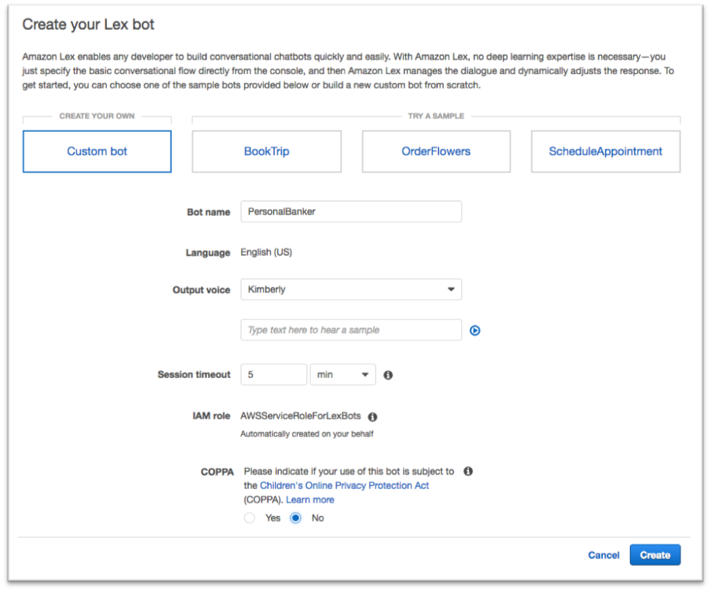

8.	Click Create
9.	We will start by creating an intent, which represents an action that the user wants to perform. For example, we’re going to create three intents in this lab for different actions a user can perform: Get Account Details; Get Loan Details; Get Loan Products.
Click the “Create Intent” button.
10.	In the window that pops-up click the “Create intent” link.

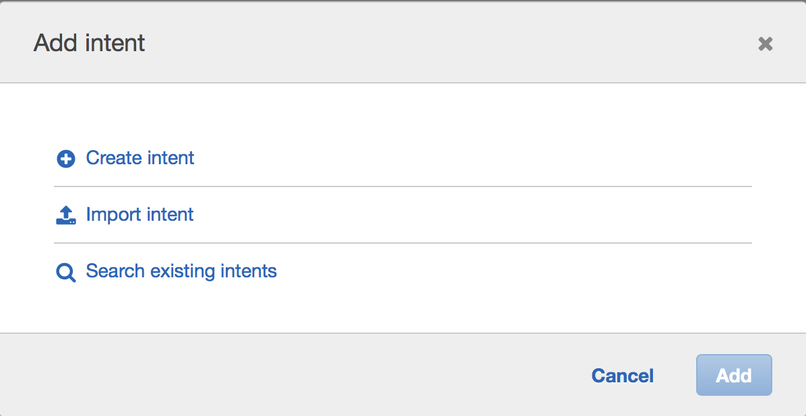

11.	Our first intent enables the user to get account details, so name this intent “GetAccountDetail” then click “Add”.

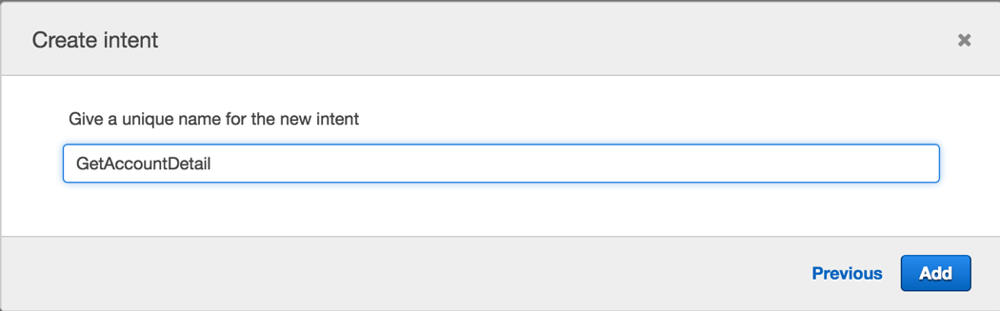

12.	We now want to provide samples of what our user would type or say to perform this action (i.e. to activate this intent). Under “Sample utterances”, type the below phrases and hit [enter] or click the blue “+” sign after each phrase. Make sure you do not add a question mark at the end of the phrase as this will cause build issues later on.
 -  What is my {AccountType} balance
 -  {AccountType} account balance
 

**NOTE:** {AccountType} represents a ‘slot’ which is information that we need to process the users request. Type it exactly as shown above with the braces, and in the next step we will define the ‘AccountType’ slot and list the acceptable values (checking, savings). Once the lab is complete, the user will interact with our bot by saying something like “What is my checking balance”.

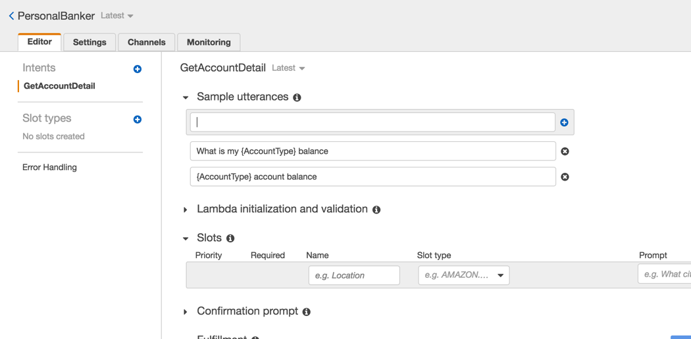

13.	Next we define a slot which is information we need to process the users request. This information can be included in the utterance (query) that the user types or says, and if not included, Lex will prompt the user for the information. While Lex includes many built-in slot types (such as number, color, city, food, etc), in this case we want to define a custom slot to get the account type that the user is referring to. 

    Click on the blue “+” sign next to “Slot types” on the left hand side of the screen

14.	For ‘Slot type name’ enter “AccountType” and optionally enter a description (although description is not required)

15.	For Value, we want to allow the user to make queries against either their “checking” or “saving” account so enter those as values, clicking the blue “+” sign after each word.

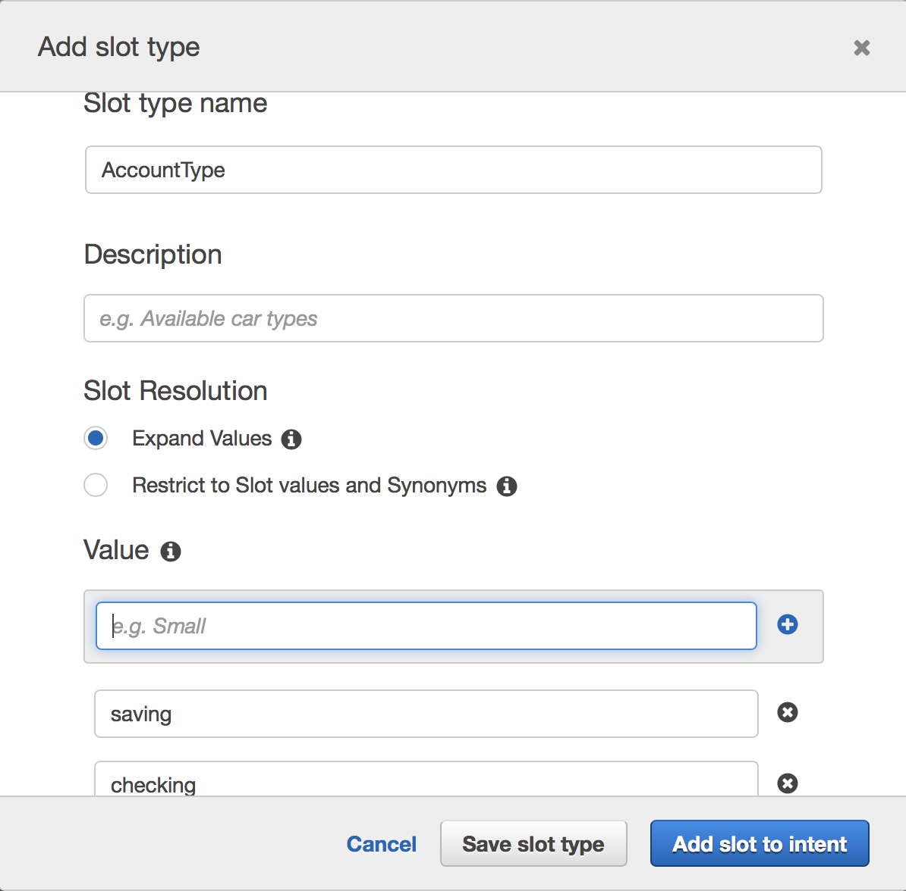

16.	Click “Add slot to intent”
17.	Change the ‘Name’ to “AccountType” so that it matches the slot name that we specified when we created the sample utterences.
18.	Specify “What type of account?” for the ‘Prompt’. This prompt will be used by our bot if the user does not specify an account type when asking a question. Make sure that the “Required” column is selected

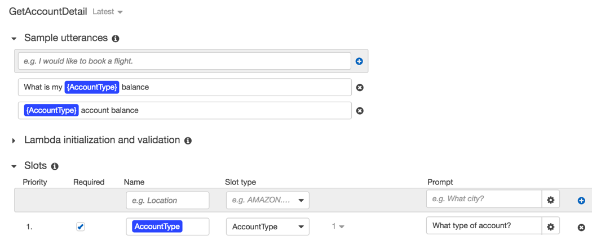

19.	Scroll down and click “Save Intent”

If at any point you made a mistake in the steps above, selecting the “Latest” version of the intent at the top, next to the intent name, will allow you to edit your choices.

20.	Let’s build this simple Bot: Hit the grey Build button at the top right corner. You will be asked for confirmation to build. Click “Build”. 

The build process takes approximately a minute. Once complete, you can ask your bot a question as a way to test it. For example, you could type “what is my checking balance?” in the chat window. At this stage since we have not added in the backend Lambda function, the response will be that the bot is ready for fulfillment. 
Let’s add 2 more intents and one more slot type.

21.	Click the blue “+” sign next to “Intents” on the left hand side of the page, then click “Create new intent”. 

22.	This intent will allow users to get information on their outstanding home or car loan balance, so set the name to “GetLoanDetail” then click ‘Add’

23.	For sample utterences (the things we expect out users to type/say to our bot to trigger a specific intent/action), add the following phrase then click the blue “+” at the end of the sample utterance box.

 - “Get my {LoanType} loan balance”
 

24.	Now we’ll create a new slot type which we’ll use to store a response from the user as to whether they are wanting the intent to access their car loan balance or their home loan balance. Click the blue “+” sign next to ‘Slot types’ on the left hand side of the screen

    - For ‘Slot type name’ enter “LoanType” and optionally provide a description
    - Enter the following two options as values:
        - car
        - home

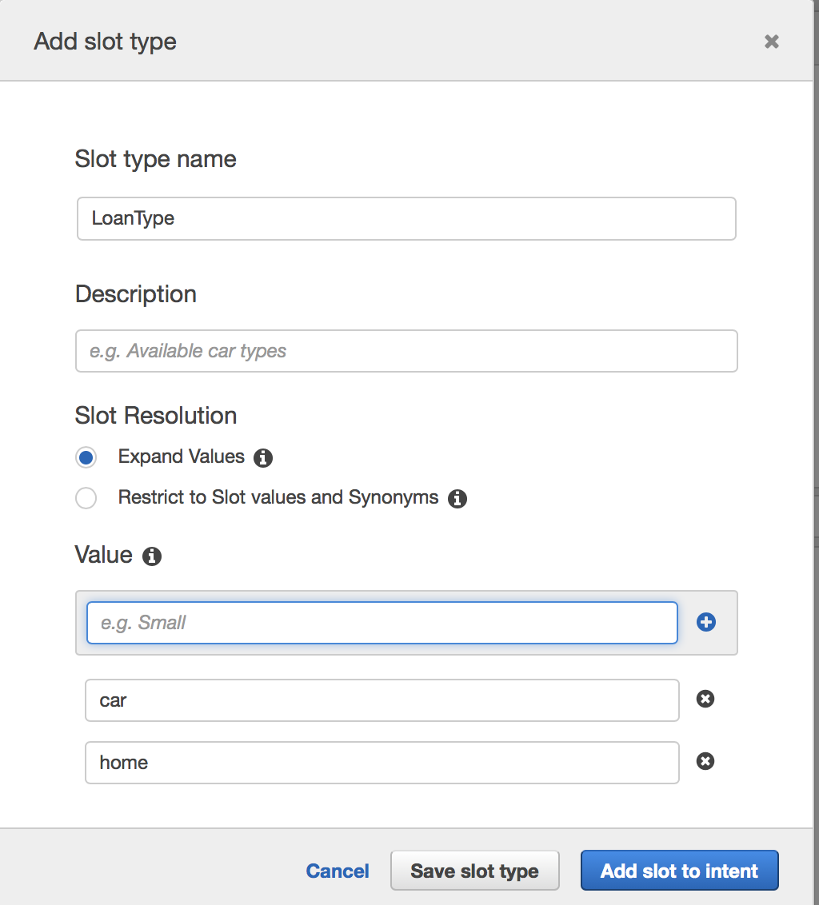

25.	Click ‘Add slot to intent’

26.	Change the name of the slot from “slotOne” to “LoanType” 

27.	Provide a prompt (such as “Which loan account?”)

28.	Make sure that the “Required” column is selected

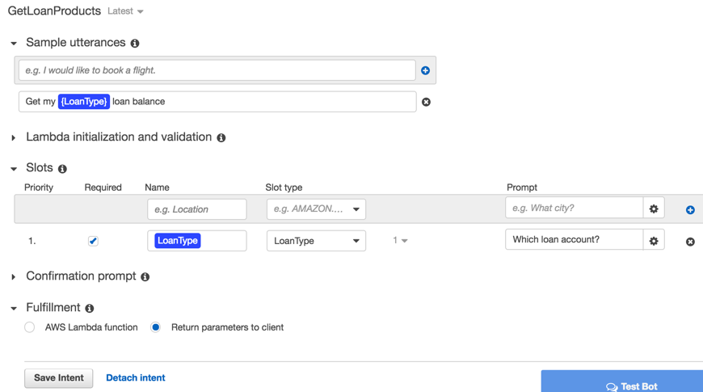

29.	Click ‘Save Intent’

Now we’ll add a final intent to allow users to get more information on the loan products that we have. 

30.	Click the blue “+” sign next to “Intents” on the left hand side of the page, then click “Create new intent”. 

31.	Set the name of the intent to “GetLoanProducts” then click ‘Add’

32.	For sample utterences (the things we expect our users to type/say to our bot to trigger a specific intent/action), add the following two phrases. Make sure not to include punctuation (such as comma’s or question marks).
    - “What is the rate on the {LoanType} loan”
    - “More loan info”

The “More loan info” utterance will be used as a follow-up after a user has asked for information on their outstanding loan balance.

33.	Add a slot (this allows us to get the loan type that the user wants to query) with the following values
    - Name: LoanType
    - Slot Type: LoanType (select from the drop-down list)
    - Prompt: Which loan type?
    
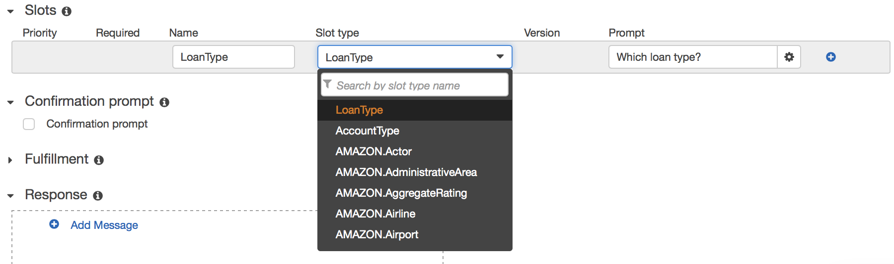
    
34.	Click the blue “+” button to the right of the Slots information to add this slot to the intent

35.	Click ‘Save Intent’

36.	Click Build, and click Build again when prompted for confirmation. 

Our bot is almost ready … all it needs now is a smart backend.

## Create a Lambda function

Here we will create a Lambda function that has some Python code to detect the intent name (‘GetAccountDetail’, ‘GetLoanDetail’ or ‘GetLoanProducts’) and to return static values based on the AccountType (checking, saving) or LoanType (car, home) included in the intent. In a real world example we would have already authenticated the user and would write Python code to do a database lookup for the account balances. 

1.	Use the AWS Console to navigate to Lambda.

2.	Click on the orange ‘Create a function’ link under the ‘Getting Started’ section

3.	On the ‘Create function’ page, click the ‘Author from scratch’ button

4.	Let’s give our function the name of “myPersonalBanker” and optionally provide a description

5.	Choose Python 2.7 as the Runtime

6.	We will ‘Create new role from template’. You can give it a “Lex-Workshop” role name and select “Test Harness permissions” as the policy template.

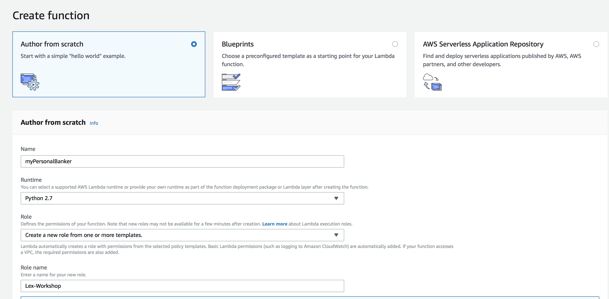

7.	Click “Create Function”

8.	We are not going to configure any trigger now, so click scroll down to Function Code

9.	Download the lambda function code you will find [here](https://raw.githubusercontent.com/dping1/AWS_Lex_Workshop/master/script/myPersonalBanker_v1.py). Copy and paste the code into the inline editor (while making sure to overwrite/delete any template code that is already in the code box)

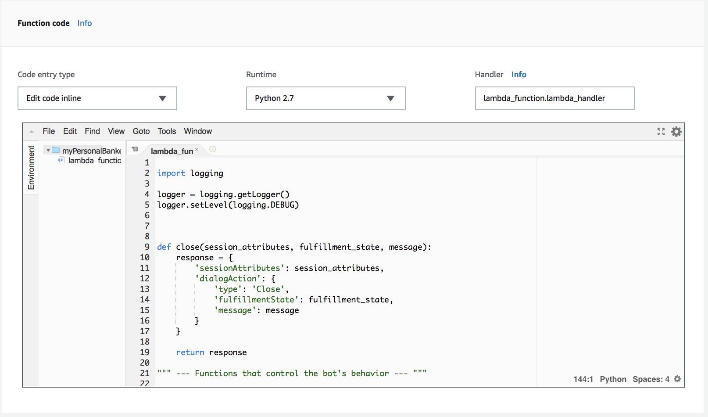

10. Click "Save" at the top to save the lambda function.

## Link the bot with the Lambda function

In this step we will link the three intents we created to the Lambda function. We do this by providing the Lambda function as the method that contains the business logic used to ‘fulfill’ the users requests. Once this is done (and the bot rebuilt), when a user specifies an intent (such as ‘what is my checking account balance’), Lex will call our Lambda function and pass it the intent name (‘GetAccountDetail’) and the slot value (‘checking’). 

To do this, we go back to the Lex Console. 
    1. Click on Personal Banker
    2. Enure the ‘GetAccountDetail’ intent is selected
    3. Make sure that the ‘Latest’ version is selected

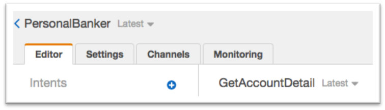

4.	Scroll down to ‘Fulfillment’, select “AWS Lambda function”, choose “myPersonalBanker” and click “OK” in the popup warning window which opens. It indicates you are giving Lex the permission to run this Lambda function.

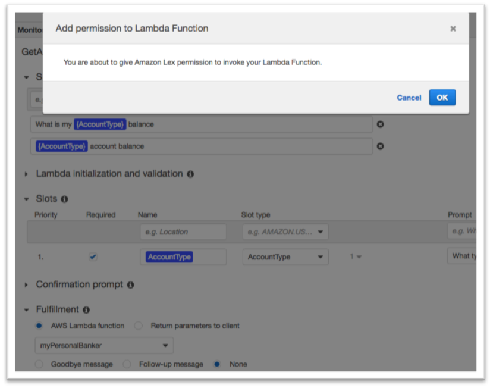

5.	Click Save intent.

6.	Repeat the above steps 4, 5 and 6 for intents GetLoanDetail and GetLoanProducts

7.	Click “Build” and then click “Build” again on the confirmation screen.

It is time we give this bot a run!

## Chat with your own bot
1.	Start by typing “What is my checking account balance?” (or press the microphone button and ask your question using your computer mic).
2.	You should get an answer. 
3.	Then type “What is my home loan balance?” (or ask using your mic)

•	Notice that Lex is able to recognize that you are wanting to trigger the GetLoanDetail intent even though what you typed, “What is my home loan balance?”, did not exactly match the sample utterance that you configured the intent with which was “Get my {LoanType} loan balance”. 

4.	Type ‘more loan info’ and see how Lex returns information on the current, new home loan rate. In this case, because we didn’t set the ‘slot’ to be required, we didn’t need to specify whether we were looking for more information on car or home loans … Lex returned information on the loan type (in this case, home) that we had just asked about.

## Conclusion
In this lab you have learned the basic operations to manage a Lex bot. First, you created a bot, then you defined intents and slot types. Finally you defined a Lambda function and attached it to your chatbot.

